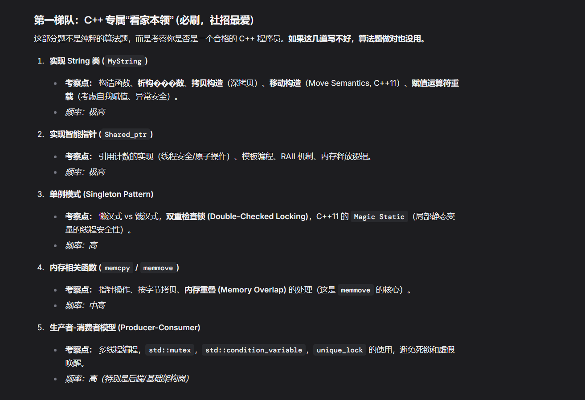
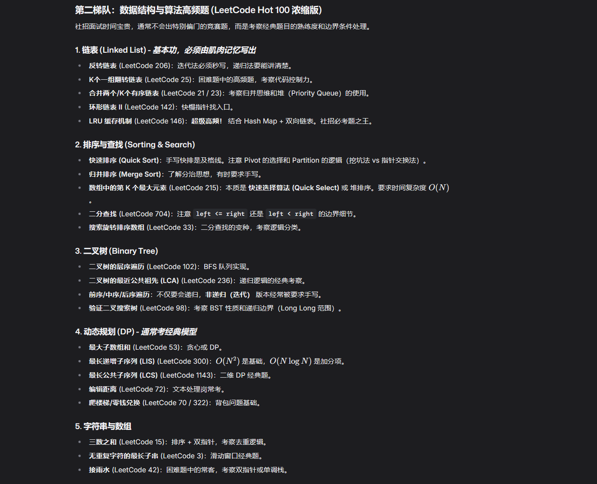

# All of Interview 

## 高频题

### 排序
1. 快速排序
2. 归并排序
### 链表
[反转链表](src/list.cpp)

### 树
二叉树遍历

### 基础轮子
1. 手写String类
2. [手写线程池](src/ThreadPool.cpp)
3. 单例模式优雅实现
4. 内存相关函数(memcpy / memmove)
5. 手写智能指针

[LRU Cache (LeetCode 146) - 必背。](src/LRU.cpp)

1. 快速排序 & 归并排序 - 必背。
2. 反转链表 (LeetCode 206) - 必须 1 分钟内写完且 0 Bug。
3. C++ String 类实现 - 必须掌握深拷贝和 Move 语义。
4. 单例模式 - 必须掌握线程安全写法。
把这 5 个搞定，心里就有底了，然后再去刷 Hot 100 中的 Tree 和 DP 题目。

